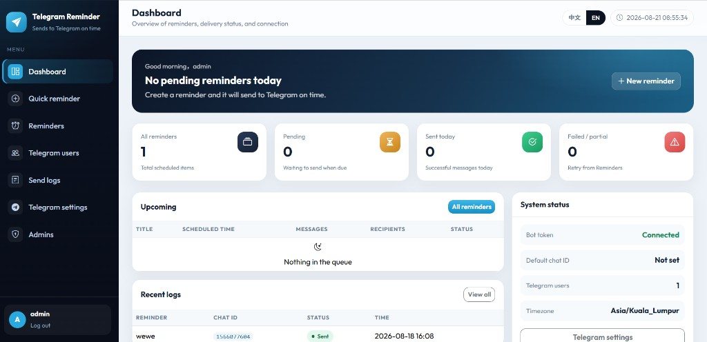
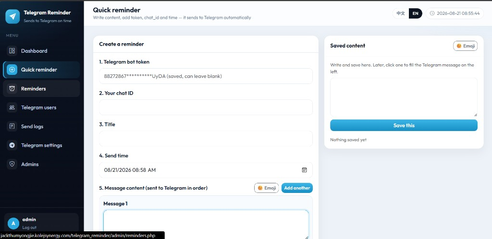
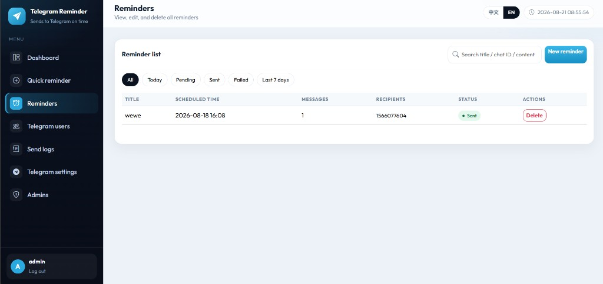
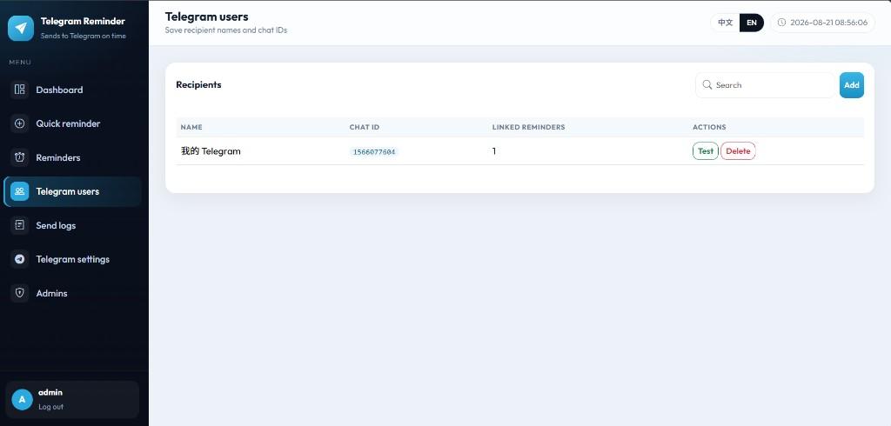
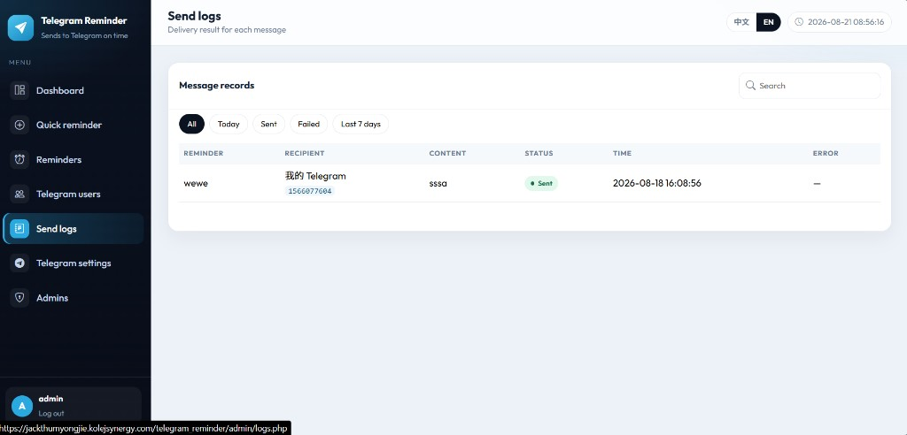
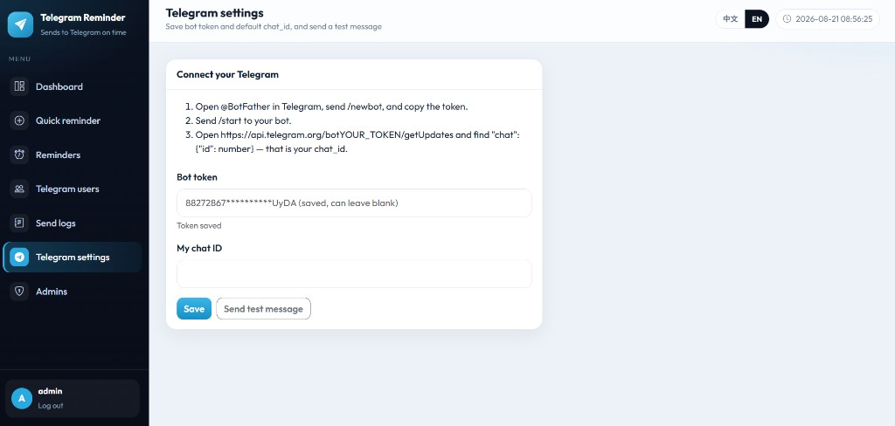
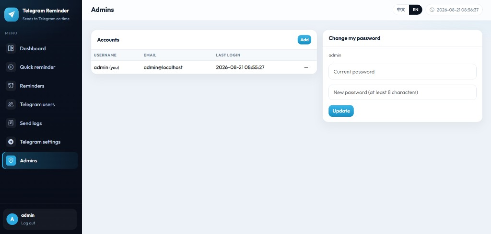

# Telegram Reminder

Admin dashboard for scheduling Telegram reminder messages — write once, pick a time, and let Cron send them automatically.

## Quick start (XAMPP)

1. Place the project in `C:\xampp\htdocs\project\telegram_reminder`
2. Copy `config/config.example.php` to `config/config.php` and fill in your database credentials
3. Start Apache + MySQL in XAMPP
4. Open http://localhost/project/telegram_reminder/
5. Tables are created automatically on first visit (or import `schema.sql`)
6. Log in with the default admin account below
7. In **Telegram settings**, paste your Bot Token; in **Telegram users**, add a chat ID
8. Open **Quick reminder**, write content, pick a time, and save
9. Locally, due reminders are checked about every 20 seconds while the admin UI is open; on production, set up Cron

Forgot password: open `admin/forgot_password.php` and request a reset link with username or email.

## Features

- Admin login only (no public registration)
- Quick reminder: title, send time, and one or more Telegram messages
- Saved content panel — reuse notes without retyping
- Emoji / phrase picker for message and note editors
- Telegram users (name + chat ID) with test send
- Reminder list with search and filters (All / Today / Pending / Sent / Failed / Last 7 days)
- Full send logs with status and error details
- Multi-admin accounts + change password + email reset token
- Chinese / English language switch (session + cookie)
- HTTP Cron engine with secret key (`cron/send_reminders.php`)
- Auto schema bootstrap on first run

## Screenshots

| Dashboard | Quick reminder |
|:---:|:---:|
|  |  |

| Reminders | Telegram users |
|:---:|:---:|
|  |  |

| Send logs | Telegram settings |
|:---:|:---:|
|  |  |

| Admins |
|:---:|
|  |

## Default login

- Username: `admin`
- Password: `admin123`

Change the password after first login.

## Folder structure

```
telegram_reminder/
├── admin/                   Admin pages (login, dashboard, create, reminders, …)
├── api/                     AJAX endpoints (reminders, users, settings, …)
├── assets/css & js          UI and page scripts
├── config/                  App + database config
├── cron/send_reminders.php  Send engine
├── docs/screenshots/        README screenshots
├── includes/                Auth, Telegram helpers, i18n, layout
├── lang/                    zh.php / en.php
├── schema.sql               MySQL tables
├── storage/                 Cron lock / logs / settings
└── index.php                Entry → login or dashboard
```

## 1. XAMPP setup

1. Copy this folder to `C:\xampp\htdocs\project\telegram_reminder`
2. Start **Apache** and **MySQL** in XAMPP
3. Copy `config/config.example.php` → `config/config.php` and edit:

```php
define('DB_HOST', 'localhost');
define('DB_NAME', 'telegram_reminder');
define('DB_USER', 'root');
define('DB_PASS', '');           // your MySQL password if any
define('APP_URL', 'http://localhost/project/telegram_reminder');
define('CRON_SECRET_KEY', 'change-me-to-a-long-random-string');
define('APP_DEBUG', true);      // false on production
```

4. Open: http://localhost/project/telegram_reminder/admin/login.php  
   Tables are created automatically on first visit.
5. Login with `admin` / `admin123`

If you prefer phpMyAdmin:

1. Create database `telegram_reminder`
2. Import `schema.sql`
3. Edit `config/config.php` with the same credentials

## 2. Create a reminder

In **Quick reminder**:

1. Bot token is shared from Settings (can leave blank if already saved)
2. Optionally enter a chat ID, or pick recipients from **Telegram users**
3. Enter title and send time
4. Write message content (use **Add another** for multiple messages)
5. Optional: open the **Emoji** picker under the editor
6. Save — use the **Saved content** panel on the right to store text and click it later to fill the message box

Status meaning:

- **Pending** — waiting for the scheduled time
- **Sent** — delivered to all recipients
- **Failed** — Telegram API error / all failed
- **Partially sent** — some recipients succeeded

## 3. Telegram bot

1. Open Telegram and chat with [@BotFather](https://t.me/BotFather)
2. Send `/newbot` and follow the steps (username must end with `bot`)
3. Copy the bot token
4. Open your new bot and send `/start`
5. Get your chat ID in a browser:

```text
https://api.telegram.org/botYOUR_TOKEN/getUpdates
```

Look for `"chat": { "id": 123456789 }` — that number is the chat ID. Group chat IDs are usually negative.

6. In this app go to **Telegram settings** → paste the token → **Save**
7. Optionally click **Send test message**
8. Go to **Telegram users** → **Add** name + chat ID
9. Create a reminder and wait for Cron (or keep the admin page open locally)

Message length limit from Telegram: **4096** characters per message.  
See also: [TELEGRAM_SETUP.md](TELEGRAM_SETUP.md)

## 4. Cron / automatic sending

The engine sends reminders whose `scheduled_time` has passed and status is still `pending`. Run it **every 1 minute**.

### Local auto-check

While an admin page is open, the frontend also pings the Cron URL about every **20 seconds** (uses `CRON_SECRET_KEY` from config).

### Windows Task Scheduler (XAMPP)

1. Task Scheduler → Create Basic Task
2. Trigger: Daily, then in Properties:
   - Repeat every: `1 minute`
   - Duration: `Indefinitely`
3. Action: Start a program
   - Program: `C:\xampp\php\php.exe`
   - Arguments: `C:\xampp\htdocs\project\telegram_reminder\cron\send_reminders.php YOUR_CRON_SECRET`

### Browser / cPanel Cron URL

```text
https://your-domain/telegram_reminder/cron/send_reminders.php?key=YOUR_CRON_SECRET
```

### Linux crontab

```bash
* * * * * php /path/to/telegram_reminder/cron/send_reminders.php YOUR_CRON_SECRET
```

Wrong or missing key → **403 Forbidden**.

## 5. Forgot password

Open `admin/forgot_password.php`, enter username or email.  
A reset link is emailed (or written to the reset log when mail is unavailable / debug mode).  
Open the link in `admin/reset_password.php?token=…` and set a new password.

## 6. Language

Top bar / login page: switch **中文** / **EN**.  
Choice is stored in session and cookie (`trms_lang`).

## 7. cPanel / production

1. Upload the whole project folder
2. Create a MySQL database and user; put credentials in `config/config.php`
3. Set:

```php
define('APP_URL', 'https://your-domain/telegram_reminder');
define('APP_DEBUG', false);
define('CRON_SECRET_KEY', 'a-long-random-secret');
```

`APP_URL` is mainly a fallback — the app also auto-detects the current host for links and redirects.

4. Add a Cron Job every minute calling the Cron URL above  
5. Login and change the default admin password

More detail: [INSTALL.md](INSTALL.md)

## System flow

1. Admin logs in
2. Admin configures Bot Token and Telegram users
3. Admin writes reminder content (and optionally saves notes for reuse)
4. Cron (or local auto-ping) finds due `pending` reminders
5. Messages are sent via Telegram Bot API to each chat ID
6. Status + send logs update on the dashboard

## Security notes

- Admin-only area; no public registration
- Passwords hashed with `password_hash()`
- CSRF token on AJAX / form posts
- Sessions after login
- `config/` and `includes/` blocked by `.htaccess`
- Cron requires `CRON_SECRET_KEY` for web and CLI
- Do not commit real production passwords — keep secrets in `config/config.php` only on the server

## Requirements

- PHP 8.2+ (PDO MySQL, cURL recommended)
- MySQL 5.7+ / MariaDB
- Timezone: `Asia/Kuala_Lumpur` (configurable in `config/config.php`)

## License

This project is licensed under the [MIT License](LICENSE).
